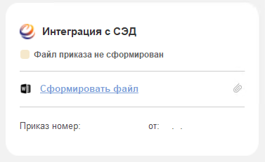

Интеграция с СЭД: Дело позволяет отправлять сформированные в ГИС Управление кадрами приказы в виде файлов .doc и отправлять их на подпись соответствующим сотрудникам в электронный документооборот. А также получать результаты подписания приказов.

## Описание процесса отправки приказа в СЭД: Дело

Для отправки приказа в СЭД нужно, чтобы текущий приказ был записан, не помечен на удаление и не утвержден (не проведен).

Всё взаимодействие клиента с СЭД-Дело производится в правой плашке на форме с заголовком «Интеграция с СЭД»

{width=377px height=231px}

1. **Формирование печатной формы приказа с метками для электронной подписи**\
   Нажимая кнопку “Сформировать файл” формируется печатная форма word файла, в которую уже зашиты метки для электронной подписи. Файл автоматически прикрепляется к интеграции с СЭД:Дело.\
   При необходимости можно прикрепить свой приказ, нажав на кнопку с картинкой Скрепки.\
   Также можно отвязать сформированный файл через кнопку с картинко Крестик

2. **Получение данных для отправки в СЭД**\
   После прикрепления файла пользователь нажимает на кнопку “Отправить в СЭД”.\
   При этом система производит следующие действия:

   -  **Проверка заполненности реквизита Руководитель** в подписях документа. Если руководитель не заполнен, то выдаётся ошибка пользователю.

   -  **Поиск организации, в которой работает Руководитель** (подтягивается из основного сотрудника физического лица, указанного в документе как Руководитель). Если организация не найдена, то выдаётся ошибка пользователю

   -  **Проверка наличия физического лица у текущего пользователя**. Если его нет, то выдаётся ошибка пользователю.

   -  **Поиск работающего на основном месте работы** (или внешним совместительством) **сотрудника** в организации по физическому лицу **текущего пользователя**. Если такой пользователь не найден, то выдаётся ошибка пользователю.

   -  Поиск идентификатора найденного сотрудника текущего пользователя в СЭД Дело.\
      Производится поиск в регистре сведений Идентификаторы сотрудников СЭД. Если он не найден, то отправляется запрос в сервис СЭД: Дело для поиска уникального идентификатора (due) сотрудника по ФИО и организации. \[ПРОПИСАТЬ ФОРМАТ И УКАЗАТЬ ССЫЛКУ НА НЕГО\]. Если идентификатор не найден, то выдаётся ошибка пользователю.

   -  Производится поиск группы приказов СЭД (описано ниже), в который отправится приказ.

3. **Отправка приказа в СЭД**\
   Если при получении данных для отправки в СЭД (п.2) не возникло ошибок, то приказ отправляется в СЭД: Дело\
   \[ПРОПИСАТЬ ФОРМАТ И УКАЗАТЬ ССЫЛКУ НА НЕГО\]\
   После этого СЭД: Дело в ответ возвращает номер проекта приказа. Этот номер система сохраняет для последующего получения результатов подписания приказа.\
   Номер проекта приказа - код отправленного в СЭД:Дело приказа, по которому он был зарегистрирован в системе.

4. **Получение результатов подписания приказов**\
   Регламентным заданием система отправляет запросы по неподписанным приказам в СЭД: Дело для получения даты и номера приказа и установки этих значений в сам приказ.

### **Группы приказов СЭД**

Группы приказов СЭД это справочник, получаемый из СЭД-Дело (через их web сервис), по которым производятся настройки отправки приказов по организациям и типам приказов.

В рамках одной группы приказа СЭД можно указать 1 организацию и произвольное количество типов приказов (Типы документов). Выбираются типы документов из списка.

Настройками групп приказов занимается сотрудник ДепИнформТехнологий - Красовский Андрей. Для этого организация, которой нужно произвести настройки, должны подать заявление в СКИТ с просьбой настроить группы доступа СЭД-Дело.

Как система определяет, какую группу приказов нужно использовать для отправки в СЭД:

1. Определяется организация, в рамках которой будет производиться подписание. Организация подтягивается **НЕ** из документа, а из организации основного сотрудника физического лица, указанного в приказе как Руководитель (в подписях)

2. В справочнике Группы приказов СЭД производится поиск данных по организации из п.1

3. Далее накладывается отбор по типу документа, указанный в таблице “Типы документов”

### Q&A

<note type="tip" title="Часто задаваемые вопросы СКИТ" collapsed="true">

**Отменить отправку в СЭД**

1. Убедиться, что проект приказа отменен в системе СЭД: Дело (это нужно спрашивать у клиента через Уточнение у инициатора). Когда убедились, что в СЭД: Дело проект приказа отменен, то двигаемся дальше

2. Открыть список отправленных приказов в СЭД Дело\
   Интеграция с СЭД -> Отправка в СЭД -> Найти нужный документ и удалить строку

3. Отписаться клиенту и закрыть задачу с текстом:\
   *Отменена отправка приказа в СЭД: Дело.\
   Повторите попытку отправки приказа, при необходимости прикрепив новый файл для подписания.*

**Настроить группы приказов СЭД: Дело**

1. Проверить, настроены ли для организации (в которой работает руководитель, указанный в приказе) и для типа документа

2. Если настроек нет, то попросить подключить специалиста Андрея Красовского (Ирина Губарева в курсе, куда это) и написать закрытый комментарий:\
   *Просим настроить группы приказов для интеграции с СЭД: Дело.*

3. Выйти из заявки в СКИТ-е

</note>

## Форматы обмена

<note type="info" title="Создание проектов документов в СЭД" collapsed="true">

<table header="row">
<tr>
<td>

Описание

</td>
<td>

Стороння система направляет запрос в СЭД на создание РКПД с приложенным файлом

</td>
<td>


</td>
</tr>
<tr>
<td>

Адрес сервиса

</td>
<td>

<http://192.168.200.47:8885/ServiceGatewayBoot/ws/SID0000304>

</td>
<td>


</td>
</tr>
<tr>
<td>

Ссылка на шине

</td>
<td>

<http://192.168.200.176:5000/api/WebServices>

</td>
<td>


</td>
</tr>
<tr>
<td>

Тип запроса

</td>
<td>

POST-запрос

</td>
<td>


</td>
</tr>
<tr>
<td>

JSON-тело запроса (пример)

</td>
<td>

\{

"name": "CreatePrj",

"token": "50874a68-ffe5-4bd6-a4d2-c806fb6ea1b1",

"data": \{

"DueDocgroup": "0.LSOQ.2NR08.",

"Date": "2022-01-01",

"Annotat": "This test project was created by webservice.",

"DuePersonExe": "0.LLG6.LVEQ.MT1E.2LLIX.",

"DeloFileList": \[

\{

"Name": "EDS_test.docx",

"Content": "0KHQvtC00LXRgNC20LDQvdC40LUg0YTQsNC50LvQsA0KDQrQotC10YHRgg=="

},

\{

"Name": "test2.txt",

"Content": "VGVzdCBB"

}

\]

}

}

</td>
<td>

DueDocgroup – ID группы документов в СЭД

Annotat – краткое наименование

DuePersonExe - ID сотрудника в СЭД

EDS_test.docx – наименование файла

</td>
</tr>
<tr>
<td>

Ответ (пример)

</td>
<td>

Project: 345758952

</td>
<td>

Ссылка в СЭД: <http://sed.admugra.local/delo/open_obj.aspx?rc_id=345758952&kind=7>

</td>
</tr>
</table>

</note>

<note type="info" title="Запрос для должностных лиц (идентификаторов в СЭД)" collapsed="true">

<table header="row">
<tr>
<td>

Описание

</td>
<td>

Запрос в СЭД информации по работающим сотрудникам

</td>
<td>


</td>
</tr>
<tr>
<td>

Адрес сервиса

</td>
<td>

<http://192.168.200.47:8885/ServiceGatewayBoot/ws/SID0000304>

</td>
<td>


</td>
</tr>
<tr>
<td>

Ссылка на шине

</td>
<td>

<http://192.168.200.176:5000/api/WebServices>

</td>
<td>


</td>
</tr>
<tr>
<td>

Тип запроса

</td>
<td>

POST-запрос

</td>
<td>


</td>
</tr>
<tr>
<td>

JSON-тело запроса (пример)

</td>
<td>

\{

```
          "name": "Vocab.GetDepartmentNodes",

          "token": "50874a68-ffe5-4bd6-a4d2-c806fb6ea1b1",

          "data": \{

                     "showDeleted": **false**,

                     "guid":"ccc6d2f9-4888-11ed-9f99-e03f49a4004a"

                 }
```

}

</td>
<td>

Добавлен необязательный параметр guid

</td>
</tr>
<tr>
<td>

Ответ (пример)

</td>
<td>

\[\{"due":"0.2KGC8.2KQZW.2KQZY.2KSQ6.","maxdue":"0.2KGC8.2KQZW.2KQZY.2KSQ6.","isn_node":"4329582",

"isn_organiz":"0","isn_high_node":"4327341","layer":"4","is_node":"1",

"classif_name":"Иванова Ирина Валерьевна - Заместитель начальника Управления - начальник отдела","name":"","surname":"","patron":"","duty":"Заместитель начальника Управления - начальник отдела","name_rp":"","surname_rp":"","patron_rp":"","duty_rp":"",

"name_dp":"","surname_dp":"","patron_dp":"","duty_dp":"","department_due":"0.2KGC8.",

"deleted":"0","phone":"","e_mail":"[ErmolaevaIV@admhmao.ru](mailto:ErmolaevaIV@admhmao.ru)","gender":"","ins_date":"01.04.2014 09:36:44","upd_date":"01.02.2023 13:18:11"}\]

</td>
<td>


</td>
</tr>
</table>

</note>

<note type="info" title="Запрос для групп документов" collapsed="true">

<table header="row">
<tr>
<td>

Описание

</td>
<td>

Запрос в СЭД информации по работающим сотрудникам

</td>
<td>


</td>
</tr>
<tr>
<td>

Адрес сервиса

</td>
<td>

<http://192.168.200.47:8885/ServiceGatewayBoot/ws/SID0000304>

</td>
<td>


</td>
</tr>
<tr>
<td>

Ссылка на шине

</td>
<td>

<http://192.168.200.176:5000/api/WebServices>

</td>
<td>


</td>
</tr>
<tr>
<td>

Тип запроса

</td>
<td>

POST-запрос

</td>
<td>


</td>
</tr>
<tr>
<td>

JSON-тело запроса (пример)

</td>
<td>

\{

```
          "name": "Vocab.GetDocgroups",

          "token": "50874a68-ffe5-4bd6-a4d2-c806fb6ea1b1",

          "data": \{

                     "showDeleted": false

                 }
```

}

</td>
<td>


</td>
</tr>
<tr>
<td>

Ответ (пример)

</td>
<td>

\[\{"due":"0.LSOQ.","classif_name":"Департамент информационных технологий и цифрового развития АО","docgroup_index":"08"},\{"due":"0.LSOQ.2RLZZ.","classif_name":"Служебные задания на командировку 08","docgroup_index":"08"},\{"due":"0.LSOQ.2UURL.","classif_name":"Приказы департамента по АХД 08","docgroup_index":"08"},\{"due":"0.LSOQ.2UXED.","classif_name":"Приказы по командировкам 08","docgroup_index":"08"},\{"due":"0.LSOQ.2UXES.","classif_name":"Приказы по отпускам 08","docgroup_index":"08"},\{"due":"0.LSOQ.2UXEV.","classif_name":"Приказы по кадровому составу 08","docgroup_index":"08"},\{"due":"0.LSOQ.2VA03.","classif_name":"Приказы НП 08","docgroup_index":"08"},\{"due":"0.LSOQ.2VEZX.","classif_name":"Заявления 08","docgroup_index":"08"},\{"due":"0.LSOQ.LSOW.","classif_name":"Приказы департамента по основной деятельности 08","docgroup_index":"08"},\{"due":"0.LSOQ.LSOY.","classif_name":"Поручения 08","docgroup_index":"08"},\{"due":"0.LSOQ.LSP2.","classif_name":"Служебные записки 08","docgroup_index":"08"}\]

</td>
<td>


</td>
</tr>
</table>

</note>

<note type="info" title="Запроса для папок подразделений" collapsed="true">

<table header="row">
<tr>
<td>

Описание

</td>
<td>


</td>
<td>


</td>
</tr>
<tr>
<td>

Адрес сервиса

</td>
<td>

<http://192.168.200.47:8885/ServiceGatewayBoot/ws/SID0000304>

</td>
<td>


</td>
</tr>
<tr>
<td>

Ссылка на шине

</td>
<td>

<http://192.168.200.176:5000/api/WebServices>

</td>
<td>


</td>
</tr>
<tr>
<td>

Тип запроса

</td>
<td>

POST-запрос

</td>
<td>


</td>
</tr>
<tr>
<td>

JSON-тело запроса (пример)

</td>
<td>

\{

```
          "name": "Vocab.GetDepartmentFolders",

          "token": "50874a68-ffe5-4bd6-a4d2-c806fb6ea1b1",

          "data": \{

                     "showDeleted": false

                 }
```

}

</td>
<td>


</td>
</tr>
<tr>
<td>

Ответ (пример)

</td>
<td>


</td>
<td>


</td>
</tr>
</table>

</note>

## Блок-схема - Жизненный цикл интеграции СЭД: Дело

<drawio path="./integraciya-s-sed-delo.svg" width="211px" height="101px"/>

## Виды приказов в СЭД Дело

<table header="row">
<tr>
<td>

#### **Вид приказа**

</td>
<td>

**Документ в ГИС УК**

</td>
</tr>
<tr>
<td>

Прием на работу

</td>
<td>

Прием на работу

</td>
</tr>
<tr>
<td>

Кадровый перевод

</td>
<td>

Кадровый перевод

</td>
</tr>
<tr>
<td>

Увольнение

</td>
<td>

Увольнение

</td>
</tr>
<tr>
<td>

Возврат из отпуска по уходу\
*(Возврат из отпуска по уходу за ребенком)*

</td>
<td>

Возврат из отпуска по уходу

</td>
</tr>
<tr>
<td>

Отпуск по уходу за ребенком

</td>
<td>

Отпуск по уходу за ребенком

</td>
</tr>
<tr>
<td>

Отпуск по беременности и родам

</td>
<td>


</td>
</tr>
<tr>
<td>

Возложение должностных обязанностей

</td>
<td>


</td>
</tr>
<tr>
<td>

Приказ о переводе (Т-5)

</td>
<td>

Кадровый перевод

</td>
</tr>
<tr>
<td>

Приказ о привлечении к работе в выходной день

*(Привлечение к работе в выходной день)*

</td>
<td>

Приказ о привлечении к работе в выходной день

</td>
</tr>
<tr>
<td>

Приказ о присвоении классного чина гражданской службы\
*(Присвоение классного чина)*

</td>
<td>

Приказ о присвоении классного чина гражданской службы

</td>
</tr>
<tr>
<td>

Отстранение от замещаемой должности

</td>
<td>


</td>
</tr>
<tr>
<td>

Отпуск Т-6

*(Ежегодный оплачиваемы отпуск)*

</td>
<td>

Отпуск Т-6

</td>
</tr>
<tr>
<td>

Отпуск без сохранения заработной платы

</td>
<td>


</td>
</tr>
<tr>
<td>

О выходе на работу в день сдачи крови и ее компонентов

</td>
<td>


</td>
</tr>
<tr>
<td>

О переносе ежегодного оплачиваемого отпуска

</td>
<td>


</td>
</tr>
<tr>
<td>

Дополнительный оплачиваемый день отдыха донорам

</td>
<td>


</td>
</tr>
<tr>
<td>

Командировка\
*(Командировка Т-9 и Командировка Т-9а)*

</td>
<td>

Командировка Командировка списком

</td>
</tr>
</table>
