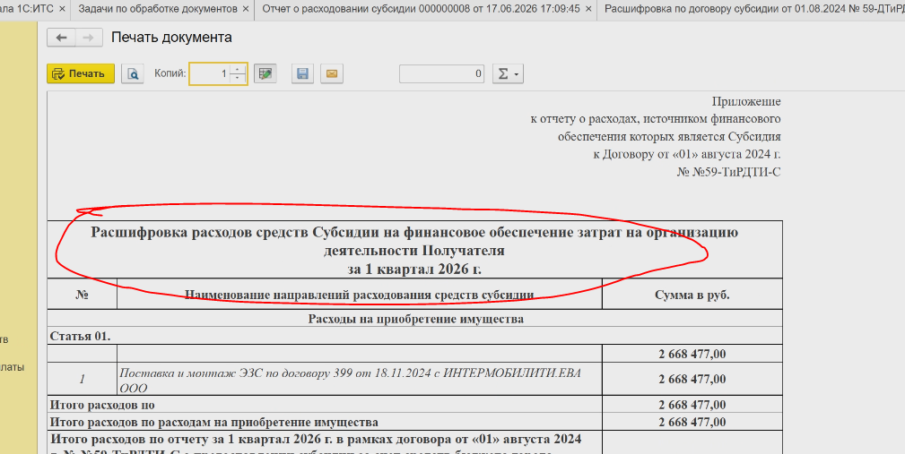

### Общая выгрузка финансироваиня

-  **Реквизиты договора субсидий** - Номер и дата договору Субсидии;

-  **КБК** - <highlight color="yellow">есть ли в системе?;</highlight>

-  **Аналитический код** - <highlight color="yellow">есть ли в системе?;</highlight>

-  **Наименование расходов** - название договора субсидии (<highlight color="blue">надо добавить</highlight>);

-  Вид расходов/Статья расходов/Наименование расходов/ЦФО расходов/Признак (доход, расход)

-  **Включен в план мероприятий** - галочка в мероприятии по каждому договору субсидии

-  **Наименование расходов/доходов (верхний уровень)**

-  **Инициатор ДТ** - Инициатор из Департамента (Контрагент и Контактное лицо)

-  **Год (доход,расход) / Год закупки** - год договора

-  **Признак года закупки** - Верхнеуровневый год мероприятия (из группировки Статей ДДС)

-  **Предмет** - либо предмет либо Выполнение работ/оказание услуг

-  **поручение ДТ** - Номер поручения Департамента

-  **Лимиты финансирования по поручению** - Лимиты по Проекту

-  **Предмет договора** - название Предмета договора

-  **Подрядчик** - Контрагент

-  **Дата и номер контракта** - Договор

-  **Цена контракта** - Сумма договора

-  **НМЦД** - НМЦД проекта

-  **Экспертиза НМЦД (п 5.1. ПОЗ)** - ???

-  **Экспертиза (5.11) Цены договор / Стоимости цены оказанных услуг -** Сумма Экспертиза по 5.11 ПОЗ

-  **Экспертиза подрядчика / Финансовый отчет** - Сумма полученного документа Финансовый отчет;

-  **Экономия** - Формула (ещё не определена)

-  **Заключение** - Если договор есть, то Заключен, иначе Не заключен

-  **оплата 1 кварта текущего года (план)** - Плановая дата оплаты по Проекту договора

-  **оплата 1 кварта текущего года (факт)** - Фактическая оплата (по платежке)

-  **Итого включено в финансовый план** - Плановая сумма за текущий год (сумма всех плановых сумм по кварталам). Цена договора / Свободный остаток (Лимит мероприятия - суммы заключенных договоров по текущему мероприятию)

-  **Итого включено в план мероприятий** - Если галочка Установлена, то Сумма договора. Иначе не законтрактованная сумма. (Сумма мероприятия - Сумма договоров)

-  **бюджет** - Галочка Бюджет в Мероприятии - «бюджет»

-  **согл Мэра** - № дата согл мэра

-  **ППМ** - № дата ППМ

Примечания:

Желтым они заполняют сами, чтобы могли загрузить по точному соответствию

Доработки:

-  В Мероприятие добавить галочку Включен в финансовый план + Год плана (по каждому договору субсидии)

-  Отбор по Фин плану (верхнеуровневая группа статей ДДС)

-  Добавить в Источники финансирования в мероприятии Галочки Бюджет. Сумма бюджета (автоматом подставлять сумму Лимита)

-  В Мероприятие добавить Цель мероприятия и Требования к результатам (просто строки)

-  В Мероприятие добавить галочку Переходящий остаток прошлого года (в таблицу Источники)

<highlight color="blue">**Рассмотреть договоры, которые могут идти по бюджету, и по Согл Мэра.**</highlight>

### ПМ +Отчет (План мероприятий)

-  Наименование мероприятия

-  Цели мероприятия и обоснование необходимости проведения мероприятия

-  Сроки исполнения в 2026 году

-  Остатки прошлых лет

   -  Лимит, руб.

   -  Законтрактовано, руб.

   -  Свободный остаток, руб.

-  Выделенные в 2026 году

   -  Лимит, руб.

   -  Законтрактовано, руб.

   -  Свободный остаток, руб.

-  Требуется дополнительное финансирование - пусто

-  Признак по источнику финансирования) -

-  Лимит  финансирования, руб.

   -  план, субсидия 2026 года

   -  план, субсидии прошлых лет

-  Лимит  финансирования  (мероприятия, реализованные в  2026 году),  руб.

   -  факт, субсидия 2026 года

   -  факт, субсидии прошлых лет

-  Требования к результатам

-  Инициатор ДТ

-  Законтрактовано, руб.

   -  факт, субсидия 2026 года

   -  факт, субсидии прошлых лет

-  Остаток средств, руб.

   -  факт, субсидия 2026 года

   -  факт, субсидии прошлых лет

Мы выгружаем договоры со всеми возможными колонками из таблицы.

Ждём от Татьяны 3 вопроса.

Хотят договор по **Манежу** посмотреть. (2 меро по 1 договору, 6 согл мэров)

Договориться о просмотре ФЭО.

Хотят посмотреть несколько финансовых форм (уже след. неделя)

1 этап.

Посмотреть этап запуска мероприятия.

Залить КП. ФЭО.

Посмотреть Выгрузка в Согл Мэра ППМ и тд.

Посмотреть 5-6 договоров

1 этап. Отчетность.

После залития договоров

## ОТЧЕТЫ по финансам

**Основной отчет** - Название договора субсидии формировать;

Главный бухгалтер - отдельным реквизитом (Расшифровка)

### БОЛЬШОЕ СОВЕЩАНИЕ

**СММ** - Согл мэра на реализацию мероприятия (доп финансирование)  - название для блока дадут.

-  Резолюции

-  Несколько ЗГД, кому передавать (1 основной, остальные дополнительные)

-  Срок

СММ - 2 номера : - Номер аппарата Мэра, - Номер вх. сообщения.

В СММ всё же галочка Приобретение имущества (тогда есть количетсво)

СММ - Кирсанова заводит. Финансистам передаёт (от руководителя) и дальше ФИнансист разбивает

?В рамках 1 резолюции 3 згд параллельно с разными сроками.

СММ - нескольпо подразделений

КП и ФЭО разбиваются на несколько мероприятий

Количество по каждому мероприятию (м.б. указывать прям в мероприятии?)

### ВТОРАЯ ПОПЫТКА ДЕМНСТРАЦИИ

Смена сроков и исполнителей Удобным сделать (для Кирсановой);

СММ убрать Количество в шапке. Галочка в таблице только;

В Сбор КП в конце Финансисты подтверждают собранные КП или возвращает;

После завершения ФЭО (если успешно / не успешно) направлять Кирсановой информацию;

Ольга ставит срок для продления;

Срок на ФЭО задаётся в документе СММ, оттуда и должно тянуться;

Автозаполнение Статуса ППМ убрать;

ДЛИНА НОМЕРА!!!!

Номер **А**ппарата **М**эра в ППМ

Нумерация номера Аппарата Мэра (в СММ и ППМ)

Доп. соглашение на ППМ, а не для Источника финансирования

Статус и Дата доведения средств в таблицу в ППМ

В Мероприятие добавить (над Инициатором) поле Ответственный ДТ (тоже Контактное лицо, как Инициатор)

Отчет по лимитам и остаткам денег по мероприятии (Сумма плановая - сумма контракта (или сумма НМЦД, если не законтрактовано). Из карточки Форма распределения ИФ - > Отчет детализации, где отобразится догоовр или проект

В форму распределения источника финансирования добавить разбиение по Кварталам также.

Галочку Фин. план в мероприятии. Считать фин планом всё что занесено

В отчеты (будущие) если пустые данные, то крестик

Галочку Включено в план мероприятий в таблицу (построчно)

В отчет ПМ только договоры, у которых Дата в 2026 году (тек год)

## Отчет о расходах

* [x] Вывод на печать кривой.

* [x] Убрать крестики в структуре ДДС, оставить только в начале и конце. Пустые выводить просто пустыми.

* [x] В группировке не выводить пустые группировки 3.

* [x] В Расшифровку не выводить строчку «Статья 01», 01 и т.д.)

* [x] Расшифровка Первичка - Сортировка по порядку Групп ДДС, не выводить данные пустых подгрупп;

* [ ] В документе сделать поля Суммы первичных документов для Заработной платы и Страховых взносов. Они должны в Детализацию и Расшифровку первички

* [x] Расшифровка. подтвержденная первичкой: Часть Статей ДДС берём по оплате. Акты и Авансовые отчеты прям из документов (отборы по датам документов)

* [ ] Отчет Расшифровка расходов.

{width=1009px height=507px}

Сюда писать :

* [ ] *Расшифровка расходов средств Субсидии за ПЕРИОД(1 квартал) по договору от ДАТА(01.08.2024) № (НОМЕР ДОГОВОРА)*

**В Расшифровке. ЕСЛИ ПРОЧЕЕ, ТО ВООБЩЕ НЕ ВЫВОДИТЬ!!!**

* [x] В детализацию Акты оказанных услуг подтягивать за тот период, за который сделаны **!Проводки! по этому документу.** Номер акта брать Номер входящего, а не документа в 1С

* [ ] В детализацию в шапку выводbть договор субсидии просто Номер и Дату (отдельными). И дальше название субсидии. Брать из названия договора субсидии (туда добавить реквизит)

* [ ] В детализацию В подписи добавить Начальник управления финансов и Бухгалтер.

* [x] !!! ПРИ ВЫВОДЕ НА ПЕЧАТЬ ПО СТРАНИЦАМ РАЗБИВАТЬ ВСЕ ОТЧЕТЫ

## ВФК

* [x] − реквизиты поручения Департамента транспорта и развития дорожнотранспортной инфраструктуры города Москвы (далее – Департамент транспорта), инициирующего закупочные процедуры (утверждающего техническое задание);

* [x] − реквизиты письма о запросе коммерческих предложений;

* [ ] <highlight color="yellow">− реквизиты служебной записки (иного документа) об инициировании закупочных процедур;</highlight>

* [ ] − реквизиты (при наличии) протокола определения начальной (максимальной) цены договора;

   <highlight color="red">Реквизиты не предусмотрены</highlight>

* [ ] − реквизиты приказа АНО «МДТО» об осуществлении закупки (при наличии);

   <highlight color="red">Реквизиты не предусмотрены</highlight>

* [ ] − реквизиты решения Департамента транспорта о согласовании крупной сделки (при наличии);

   <highlight color="red">Реквизиты не предусмотрены</highlight>

* [ ] − реквизиты поручения о согласовании единственного поставщика;

   <highlight color="red">Реквизиты не предусмотрены</highlight>

* [x] − пункт в положении о закупках АНО «МДТО» и пункт Устава АНО «МДТО» в соответствии с которым будет реализована закупочная процедура;

* [x] − реквизиты договора (дополнительного соглашения);

* [x] − реквизиты контрагента;

* [x] − предмет закупочной процедуры/договора;

* [x] − наименование мероприятия, в рамках которого заключается договор;

* [ ] − пункт перечня направлений расходования субсидии (реквизиты реестра платежей при необходимости);

   <highlight color="red">Реквизиты не идентифицированы</highlight>

* [x] − название и реквизиты закрывающих документов (в привязке к договору с контрагентами);

* [ ] − реквизиты мотивированного отказа от принятия закрывающих документов (при необходимости, в привязке к договору);

* [ ] − реквизиты акта передачи оригиналов закрывающих документов по исполнению договора с контрагентом в Управление бухгалтерского учета и отчетности;

   <highlight color="red">Реквизиты не предусмотрены</highlight>

* [x] − реквизиты заявки на платеж (реестра платежа при наличии);

* [x] − размер авансового платежа (итогового) платежа;

* [ ] − реквизиты приказа о проведении инвентаризации:

   <highlight color="red">Реквизиты не предусмотрены</highlight>

* [ ] − реквизиты акта о проведении инвентаризации;

   <highlight color="red">Реквизиты не предусмотрены</highlight>

* [ ] − реквизиты инвентаризационных описей;

   <highlight color="red">Реквизиты не предусмотрены</highlight>

* [x] − реквизиты акта сверки взаиморасчетов с контрагентами;

* [ ] − реквизиты документа, подтверждающего расчеты с бюджетом, сформированного в системе 1С;

   <highlight color="red">Реквизиты не предусмотрены</highlight>

* [x] − реквизиты служебной записки в адрес Правового управления о начале претензионной работы;

* [x] − причина необходимости начала претензионной работы

ДЕЙСТВИЯ

* [x] − нарушение сроков внесения сведений о заключении, изменении, расторжении, исполнении и оплате договоров в Единую автоматизированную информационную систему торгов города Москвы;

* [x] − возврат инициаторам закупочных процедур (АНО «МДТО») материалов, направленных в Управление закупок для организации и проведения процедур закупок, с указанием соответствующих причин и оснований;

* [x] − выявление признаков аффилированности между деловыми партнерами;

* [x] − нарушение регламентных сроков предоставления закрывающей отчетной документации по контрактным обязательствам;

* [x] − нарушение регламентных сроков рассмотрения АНО «МДТО» представленной отчетной документации, включая сроки направления мотивированных отказов от их принятия;

* [x] − нарушение сроков оплаты, установленных в договорах с контрагентами;

* [x] − нарушение сроков передачи в Управление бухгалтерского учета и отчетности оригиналов закрывающих документов по исполнению договоров с контрагентами.

## ВФК

* [x] При выполнении задачи плашка ВФК не пропадает.

* [x] В операцию ВФК добавить список Ответственных.

* [x] Отбор по Подразделению (отбирать по Исполнителю Пользователь.Подразделение)

* [ ] С Галутво по пункту ПОЗ

* [x] **Ссылка на источник (Проект договора) не встаёт;**

* [x] Отправить Палагиной список реквизитов, чтобы она дала ответ, как выводить это в печать (условное Пункт ПОЗ: 5.1)

* [x] В Карту ВФК не выводится ФИО и должность Утвердил

* [x] Установить должности сотрудников

* [x] Если выполняется задача в рамках контрольного действия и Срок просрочен. не давать двигаться дальше.

* [x] Претензионно-исковая работа - проверить заполнение Выявленные недостатки

## СВОДНЫЙ ОТЧЕТ

* [x] Распределение суммы оплат по Бюджету и ППМ/СММ

## 4 АВГУСТА

-  Обсуждение ПОСЛЕ увольнения Ахмеда;

**Участники:** Максим Солошенков, Тимур Тухватуллин, Иван Косов, Тихон Марков (+Вусал, Тарас);

**Что у них сейчас:**

-  Внесли все данные по поручения, по финансовой части. Работают над тем, чтобы связать между собой данные;

-  На каком именно моменте не знают. Просят помочь и проконтролировать, чтобы данные внеслись корректно;

**Солешников Максим** выдвигается как контроллер;