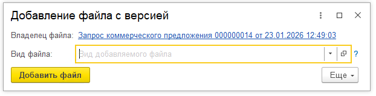
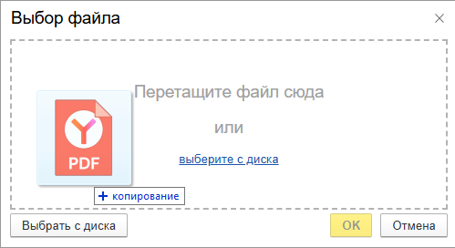
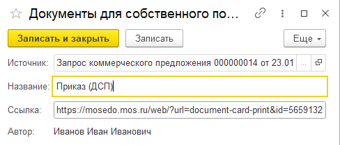

-  Глосарий

   -  Что такое документ

   -  Как Файлы связаны с Документами

   -   

-  Работа с файлами

   -  Виды файлов

   -  Как добавить произвольный файл

   -  Как добавить определенный Вид файла

   -  Добавить файл ДСП

   -  Связать файл с другого документа

   -  Версии файлов

   -  Удалить файл

   -  Ограничения работы с файлами

-  Работа с задачами

   -  Область задачи (из чего состоит)

   -  Выполнить задачу

   -  Отменить задачу

   -  Список задач Документа

   -  Карта бизнес-процесса Документа

   -   

## Работа с файлами

Файлы, присоединяемые в карточку Документа, разделяются на:

-  **Произвольные файлы** - файл любого формата. В списке файлов документа отображается с видом «***Произвольный файл***»

-  **Файлы по видам** - файл любого формата с указанием его вида. Виды файлов определяются для каждого **Вида документа** и настраиваются Администраторами Системы.

-  **Связанные файлы** - ссылка на файл любого формата, подключенная в карточку документа из другого связанного документа. Данный файл физически не принадлежит текущему документу. В списке файлов документа отображается с видом «***Связанный файл***».

-  **Документы ДСП** - ссылки на произвольные интернет ресурсы. Применяется для хранения ссылок на сторонние ресурсы, загрузка которых в виде файла недоступна (например, документы со штампами Для собственного пользования).

### Как добавить файл

Для добавления файла на форме документа в разделе «Файлы»:

1. Нажмите команду «**Прикрепить**» *(или в любой области списка нажмите правую кнопку мыши и выберите команду «**Прикрепить файл**»)*.

   <image src="./_index.png" crop="0,0,100,100" objects="square,10.5185,0.8734,17.7778,17.9039,,top-left" width="675px" height="229px" float="center"/>

   <note type="danger" title="Ошибка: Недостаточно прав для редактирования" collapsed="true">

   Если документ находится в обработке не у вашего пользователя, или обработка документа завершена (выполнены все задачи в рамках текущего документа), Система выдаст ошибку «*Недостаточно прав для редактирования*». Загрузка файлов будет недоступна.

   </note>

2. Если требуется загрузить файл определенного вида, выберите его из выпадающего списка реквизита «**Вид файла**». Если требуется загрузить произвольный файл без привязки к определенному виду, оставьте поле Вид файла пустым.

   {width=622px height=159px}

3. Нажмите на команду «**Добавить файл**».

4. В открывшемся окне загрузите файл через команду «Выбрать файл с диска» или перетащите файл в соответствующий блок

   {width=499px height=272px}

5. Для завершения загрузки файла нажмите на команду «**Ок**». Для отмены загрузки файла нажмите на команду «Отмена».

   <image src="./instrukcii-4.png" crop="0,0,100,100" objects="square,70.8,83.209,11.6,15.2985,,top-left" width="500px" height="268px" float="center"/>

6. После завершения загрузки, файл отобразится в списке.

   <image src="./instrukcii-7.png" crop="0,0,100,100" objects="square,0,75,100,23.6842,,top-left" width="661px" height="152px" float="center"/>

### Как добавить  Документ ДСП

Для добавления Документа ДСП (для собственного пользования) на форме документа в разделе «Файлы»:

1. Нажмите на команду «**Документ ДСП**»

   <image src="./instrukcii-5.png" crop="0,0,100,100" objects="square,27.7037,1.7467,19.8519,16.1572,,top-left" width="675px" height="229px" float="center"/>

2. В открывшейся форме введите название документа (или произвольной ссылки) в поле **Название**.

3. Вставьте ссылку на интернет-ресурс, хранящий документ ДСП в поле **Ссылка**.

   {width=488px height=209px}

4. Нажмите на команду **Записать**, чтобы сохранить данные в Системе, либо на команду **Записать и закрыть**, чтобы сохранить данные в Системе и закрыть форму ввода данных.