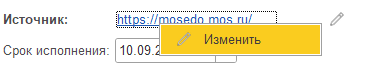

### Как создать Входящее поручение

Для создания нового документа Входящее поручение на форме «Задачи по обработке документов» :

1. Перейдите в раздел **Входящие поручения**

   <image src="./vkhodyaschee-poruchenie.png" crop="0,0,100,100" objects="square,0.4219,58.7629,37.8059,18.9003,Раздел \"Входящие поручения\",top-left&square,38.7342,46.7354,8.1013,13.7457,Команда \"Создать Входящее поручение\",top-left" width="1185px" height="291px" float="center"/>

2. В списке «Входящие поручения» нажмите на команду **Создать**

3. Заполните реквизиты документа:

   1. <note type="info" title="Реквизиты документа" collapsed="true">

      1. **Мероприятие** - выберите из выпадающего списка Мероприятие, к которому приурочено входящее поручение (если мероприятие известно).

      2. **Организация** - Организация, производящее обработку Входящего поручения (устанавливается автоматически значением «МДТО АНО»);

      3. **Номер** - номер Входящего поручения (обязательно для заполнения);

      4. **Дата** - (поле «от», расположенное правее от реквизита «Номер») Дата Входящего поручения (обязательно для заполнения);

      5. **Исх №** - номер исходящего сообщения;

      6. **Дата исх.** \- (поле «от», расположенное правее от реквизита «Исх №») дата исходящего сообщения;

      7. **От кого** - организация, направившее Входящее поручение;

      8. **Адресат** - Контактное лицо со стороны организации, направившего Входящее поручение;

      9. **Генеральный директор** - пользователь, занимающий должность Генерального директора в Организации;

      10. Ответственный **За поручение** - пользователь, ответственный за обработку Входящего поручения (заполняется автоматически значением текущего пользователем и недоступна для редактирования);

      11. Ответственный **За проект** - пользователь, ответственный за создание карточек Проекта для дальнейшей инициализации Проекта;

      12. **Источник** - ссылка на интернет-ресурс *(например, ссылка на документ во внешнем документооборотк)*, являющийся источником входящего поручения;

          <note type="info" title="Работа с реквизитом Источник" collapsed="true">

          **Как внести ссылку на Источник**

          1. Нажмите на команду **Вставить ссылку**

          2. Вставьте ссылку на Источник в открывшееся **поле ввода**

             <image src="./vkhodyaschee-poruchenie-2.png" crop="0,0,100,100" objects="square,21.7308,4.3062,25.9615,14.3541,,top-left&square,2.1154,55.9809,94.0385,20.0957,,top-left" width="520px" height="209px" float="center"/>

          3. Нажмите на команду **Ок**

          **Как изменить ссылку на Источник**

          1. Нажмите на команду **Изменить ссылку**, которая отображается на форме как иконка серого карандаша (или нажмите на ссылку на Источник правой кнопкой мыши и в появившемся списке выберите команду **Изменить**.

             {width=376px height=74px}

          </note>

      13. **Содержание** - описание Входящего поручения;

      14. **Статус исполнения** - текстовое поле для указания отметки об исполнении Входящего поручения;

      15. **Резолюции** - список резолюций в виде текста;

      16. **Комментарий** - поле для ввода произвольной информации;

      17. **Создатель** - пользователь, создавший карточку документа Входящее поручение (заполняется автоматически значением текущего пользователем и недоступна для редактирования);

      </note>

4. Нажмите на команду **Записать**, чтобы сохранить внесенные данные в Системе. 

5.  

### Как загрузить данные в карточку Входящего поручения из МосЭДО

Для заполнения реквизитов в карточке документа Входящее поручение выполните следующие действия:

1. На форме документа нажмите на команду **Загрузить из файла;**

   <image src="./vkhodyaschee-poruchenie-4.png" crop="0,0,100,100" objects="square,84.1379,32.7434,15.431,21.2389,,top-left" width="1160px" height="226px" float="center"/>

2. Выберите выгруженный из МосЭДО файл в формате html

   <note type="info" title="Подробнее" collapsed="true">

   Из файла заполняются только те реквизиты, которые доступны для редактирования. Если какой-то реквизит документа недоступен для ввода, то эти данные не будут заполнены и из файла.

   </note>

### Как загрузить файл Входящего поручения в карточку документа Входящее поручение